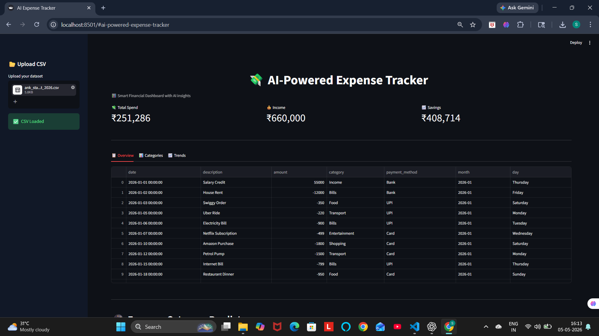
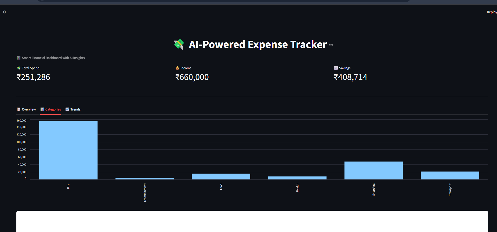
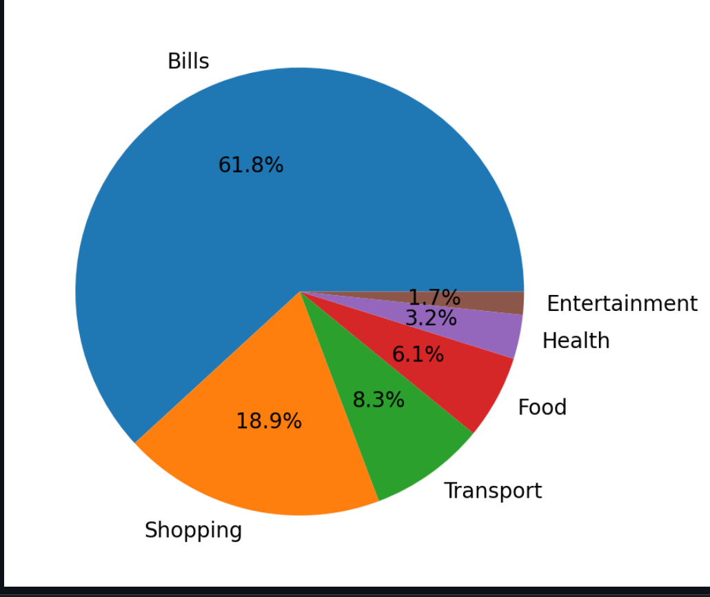
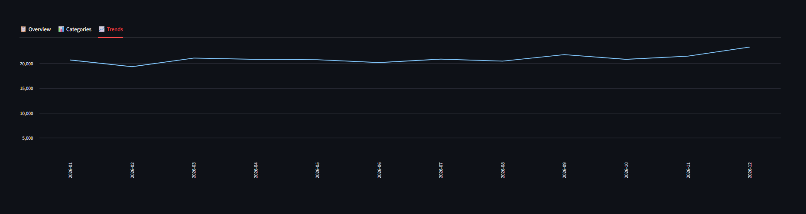
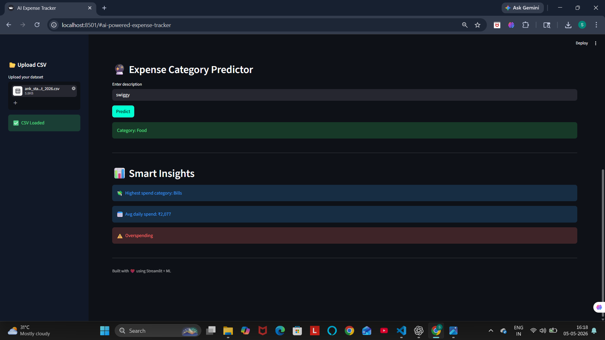
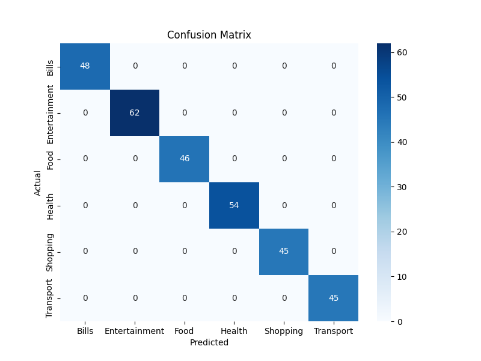
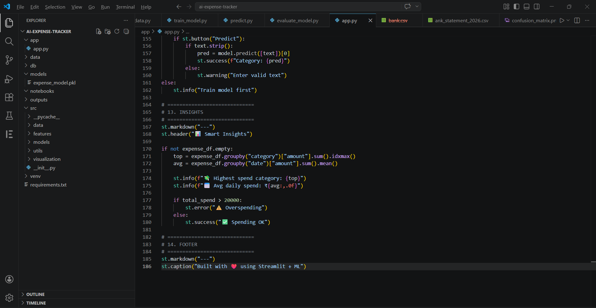

# 💸 AI-Powered Expense Tracker (End-to-End ML + Analytics System)

> A production-style personal finance analytics system that combines **data engineering, machine learning, and interactive visualization** to deliver actionable financial insights.

---

## 🚀 Overview

This project is not just a dashboard—it simulates a **real-world fintech analytics pipeline**:

* Ingests structured/unstructured expense data (CSV or default dataset)
* Cleans and validates inconsistent schemas automatically
* Applies Machine Learning for **expense categorization**
* Generates **behavioral insights and budget signals**
* Presents everything in a **modern interactive UI (Streamlit)**

---

## 🎯 Problem Statement

Most individuals track expenses manually without extracting meaningful insights.
This leads to:

* Poor financial decisions
* Lack of spending awareness
* No predictive categorization

👉 This project solves that by combining:

* Automated categorization (ML)
* Data visualization
* Insight generation

---

## 🧠 System Architecture

```text
User Input (CSV / Default Data)
        ↓
Data Cleaning & Validation
        ↓
Feature Engineering (Text → TF-IDF)
        ↓
ML Model (Logistic Regression)
        ↓
Predictions + Aggregations
        ↓
Visualization Layer (Streamlit)
        ↓
Insights & Alerts
```

---

## ⚙️ Core Features

### 📊 1. Interactive Dashboard

* KPI Cards:

  * Total Spend
  * Total Income
  * Net Savings
* Responsive layout (wide mode)
* Clean dark UI with custom CSS

---

### 📈 2. Data Visualization

* Category-wise spending:

  * Bar Chart
  * Pie Chart
* Monthly trend analysis:

  * Time-series line chart
* Fully dynamic based on input dataset

---

### 🔮 3. Machine Learning Prediction

* Input: Free-text expense description
* Output: Predicted category

#### Model Pipeline:

```text
Text → TF-IDF Vectorization → Logistic Regression → Prediction
```

* Handles unseen text inputs
* Fast and lightweight inference

---

### 📂 4. CSV Upload + Auto Handling

* Upload custom datasets
* Automatically:

  * Normalizes column names
  * Fixes spacing issues
  * Handles case inconsistencies
  * Drops invalid rows

👉 Example handled cases:

* " Date " → "date"
* "AMOUNT" → "amount"

---

### 📊 5. Smart Business Insights

* Highest spending category
* Average daily spend
* Spending patterns
* Budget alerts:

  * Overspending detection
  * Controlled spending feedback

---

### 🛡️ 6. Robust Error Handling

* Missing column detection
* Invalid date handling
* Empty dataset protection
* Model availability check

---

## 🧪 Dataset Schema

Your CSV must follow:

```csv
date,description,amount,category,payment_method
```

### Rules:

* Positive amount → Income
* Negative amount → Expense
* Date format → `YYYY-MM-DD`

---

## 📂 Project Structure

```text
AI-Expense-Tracker/
│
├── app/
│   └── app.py              # Main Streamlit app
│
├── src/
│   ├── data/
│   │   ├── generate_data.py
│   │   └── load_data.py
│   │
│   ├── models/
│   │   └── train_model.py
│   │
│   ├── utils/
│   └── visualization/
│
├── data/                   # CSV datasets
├── models/                 # Trained ML model (.pkl)
├── outputs/                # Generated plots
│
├── requirements.txt
└── README.md
```

---

## ⚙️ Installation Guide

### 1️⃣ Clone Repository

```bash
git clone https://github.com/your-username/AI-Expense-Tracker.git
cd AI-Expense-Tracker
```

---

### 2️⃣ Create Virtual Environment

```bash
python -m venv venv
venv\Scripts\activate
```

---

### 3️⃣ Install Dependencies

```bash
pip install -r requirements.txt
```

---

### 4️⃣ Train Model (IMPORTANT)

```bash
python -m src.models.train_model
```

---

### 5️⃣ Run Application

```bash
streamlit run app/app.py
```

---

## 📊 Example Workflow

1. Launch app
2. Upload CSV OR use default dataset
3. View:

   * KPIs
   * Charts
   * Trends
4. Enter text:

   * “Swiggy order” → Predict category
5. Analyze insights

---

## 🧠 Machine Learning Details

| Component     | Description         |
| ------------- | ------------------- |
| Model         | Logistic Regression |
| Input         | Text (description)  |
| Vectorization | TF-IDF              |
| Output        | Category label      |

---

## 📈 Performance

* Lightweight model → fast inference
* Handles small-to-medium datasets efficiently
* Suitable for real-time dashboards

---

## 💼 Real-World Applications

* Personal finance tracking apps
* Expense management systems
* Fintech dashboards
* Budget planning tools

---

## 📸 Screenshots & System Walkthrough

### 🖥️ Full Dashboard Overview
<p align="center">
  
</p>

---

### 📊 Category Analysis (Spending Breakdown)
<p align="center">
  
</p>

---

### 🥧 Expense Distribution (Pie Chart View)
<p align="center">
  
</p>

---

### 📈 Monthly Spending Trends
<p align="center">
  
</p>

---

### 🔮 AI Prediction System (ML Output)
<p align="center">
  
</p>

---

### 🧠 Model Evaluation (Confusion Matrix)
<p align="center">
  
</p>

---

### 📊 Feature Visualization
<p align="center">
  
</p>

---

### 🗂️ Project Structure
<p align="center">
  
</p>

## 🚀 Future Enhancements

* 🔐 User authentication system
* 🗄️ Database integration (SQLite/PostgreSQL)
* 📱 Mobile-friendly UI
* 📉 Anomaly detection (fraud / overspending)
* ☁️ Cloud deployment

---

## 🧠 Key Learnings

* End-to-end ML pipeline implementation
* Data cleaning & validation strategies
* Streamlit UI design
* Real-world project structuring
* Handling user-generated data

---

## 👨‍💻 Author

**Sujal Kumar Shaw**

---

## ⭐ Contribution & Support

If you found this useful:

* ⭐ Star this repo
* 🍴 Fork it
* 📢 Share with others

---

## 📜 License

This project is licensed under the MIT License.
